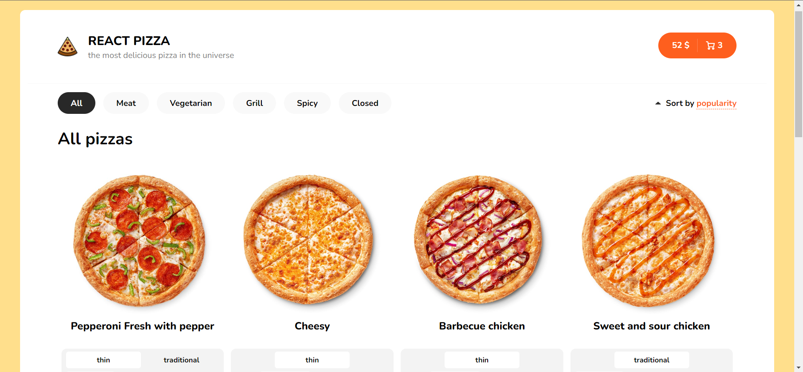

<div id="top"></div>

<!-- PROJECT LOGO -->
<br />
<div align="center">

<h3 align="center">React Pizza</h3>

  <p align="center">
    <a href="https://freekson.github.io/React-Pizza/">View Demo</a>
    ·
    <a href="https://github.com/Freekson/React-Pizza/issues">Report Bug</a>

  </p>
</div>

<!-- TABLE OF CONTENTS -->
<details>
  <summary>Table of Contents</summary>
  <ol>
    <li>
      <a href="#about-the-project">About The Project</a>
    </li>   
    <li><a href="#license">Tech Stack Used</a></li>
    <li><a href="#installation">Installation</a></li>
    <li><a href="#contact">Contact</a></li>
  </ol>
</details>

<!-- ABOUT THE PROJECT -->

## About The Project



## Tech Stack Used

-   ReactJS
-   React Router
-   React Skeleton
-   React Hooks
-   SCSS-Modules / SASS(SCSS syntax) for styling
<!-- GETTING STARTED -->

## Installation

1. Clone the repo
    ```sh
    git clone https://github.com/Freekson/React-Pizza.git
    ```
2. Install NPM packages
    ```sh
    npm install
    ```
3. Run command
    ```sh
    npm run start
    ```

<!-- CONTACT -->

